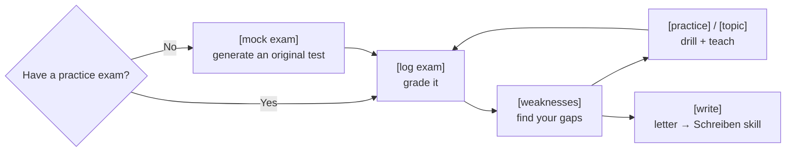

# telc B1 Coach 🇩🇪

**🌍 Languages:** **English** · [العربية](docs/README.ar.md) · [Türkçe](docs/README.tr.md) · [Русский](docs/README.ru.md) · [Українська](docs/README.uk.md) · [فارسی](docs/README.fa.md) · [Español](docs/README.es.md)

[](https://skills.sh/aabuhammam-dh/telc-b1-coach)
[](https://github.com/aabuhammam-dh/telc-b1-coach/actions/workflows/ci.yml)

[](https://github.com/aabuhammam-dh/telc-b1-coach/stargazers)


Two free add-ons ("skills") that turn **Claude** — or another AI that supports skills — into
a strict, no-nonsense coach for the **telc Deutsch B1** exam. It grades your practice
answers, explains every mistake, drills your weak spots, prepares you for the speaking test,
and coaches your writing.

> ⭐ If this helps your prep, **star the repo** — it helps other learners find it.

<p align="center">
  
</p>

> For the general **telc Deutsch B1** exam (the adult *Zertifikat Deutsch*). **Not** the DTZ,
> and not Goethe B1.

This guide is written so that **anyone with this link can get it running in a few minutes**,
even if you've never used a "skill" before. Just follow the section for the app you use.

---

## What you get

Two skills that work together:

- **`telc-b1-exam`** — logs and grades your answers to a practice exam, tells you *why* each
  answer was wrong (the trap + the rule), pulls the important vocabulary, connectors, and
  grammar out of a test, drills your weak points, runs speaking practice, and — if you don't
  have any practice exams — **generates fresh, original ones for you** in the real telc
  format. Grammar questions get answered from real sources, explained simply.
- **`telc-b1-schreiben`** — coaches the **written letter**: teaches the format, grades your
  letter the way real examiners do, and drills the mistakes you keep repeating.

You ask for things in plain language (*"grade my answers"*, *"explain weil vs. denn"*,
*"would this letter pass?"*) or with short commands like `[log exam]` or `/written-grade`.

> [!TIP]
> No practice exams? Just type `[mock exam]` and it generates original ones.

---

## How it works



One loop: generate or grade an exam, find your weak spots, drill them, repeat — and split off
to the writing coach whenever you work on the letter.

---

## Step 1 — Download the skills from this page

1. Scroll to the top of this repository.
2. Click the green **`< > Code`** button, then **Download ZIP**.
3. Unzip the file you downloaded. Inside you'll find a **`skills/`** folder
   containing the two skills: **`telc-b1-exam`** and **`telc-b1-schreiben`**.

That's it — those two folders *are* the skills. Now install them in your AI using the
matching section below.

---

## Step 2 — Install them (pick your app)

### ⚡ Fastest — one-line install for Claude Code & other CLIs

If you have [Node.js](https://nodejs.org) installed, a single command adds **both** skills to **Claude Code** (and Gemini CLI, Cursor, Codex, and other tools that follow the Agent Skills standard):

```bash
npx skills add aabuhammam-dh/telc-b1-coach
```

Restart your AI tool afterwards and the skills load automatically. *(This uses the open-source [`skills`](https://github.com/vercel-labs/skills) installer from the Agent Skills ecosystem — community-maintained, not an official Anthropic tool.)*

**Prefer Claude Code's built-in plugin marketplace?** Add this repo as a marketplace, then install the plugin:

```text
/plugin marketplace add aabuhammam-dh/telc-b1-coach
/plugin install telc-b1-coach@telc-b1-coach
```

Not a terminal person, or using the Claude website? Pick an option below instead.

### 🟣 Option A — Claude website or Claude app (most people)

1. **Zip each skill folder on its own.** You need a separate `.zip` for each skill:
   - **Mac:** right-click the `telc-b1-exam` folder → **Compress**. Repeat for
     `telc-b1-schreiben`.
   - **Windows:** right-click the folder → **Send to → Compressed (zipped) folder**. Repeat
     for the other.
   *(You should end up with `telc-b1-exam.zip` and `telc-b1-schreiben.zip`.)*
2. In Claude, click your **profile icon → Settings → Capabilities**, and make sure
   **Code execution and file creation** is turned **on**. *(This is the one thing skills
   actually need.)*
3. Go to **Customize → Skills**, click **Upload skill**, and choose `telc-b1-exam.zip`.
   Do it again for `telc-b1-schreiben.zip`.
4. Done. Claude uses them automatically when you talk about the telc B1 exam. Skills you
   upload here work in both **Claude Chat** and **Cowork**.

> **Works on the Free plan too** — skills are available on **Free, Pro, Max, Team, and
> Enterprise**; the only requirement is that **Code execution and file creation** is enabled
> (step 2). On Free you just have the normal daily message limit. On **Team/Enterprise**, an
> owner may need to switch Skills on for the organisation first (it's on by default for
> Team). Uploading here does **not** copy the skills to Claude Code or the API — those are
> separate (see below). Menu names can vary slightly by version.

<details>
<summary>🟢 Option B — Claude Code (terminal / VS Code / JetBrains)</summary>

No zipping, no uploading — skills are just folders on your computer.

1. Create the skills folder if it doesn't exist: `~/.claude/skills/`
   *(that's a folder named `skills` inside a hidden `.claude` folder in your home directory).*
2. Copy **both** skill folders — `telc-b1-exam` and `telc-b1-schreiben`, found inside
   the download's `skills/` folder — into it.
3. Restart your Claude Code session. It discovers and uses them automatically.

*(Want them only inside one project instead of everywhere? Put the folders in that project's
`.claude/skills/` folder instead.)*

</details>

<details>
<summary>🔵 Option C — Another AI that supports skills (Gemini, Codex, Cursor, Copilot…)</summary>

Agent Skills is an **open standard**, so the *same folders* work in many other AI tools.
There are two cases:

**C1 — Coding tools that read `SKILL.md` files** (Gemini CLI, OpenAI Codex CLI, Cursor,
GitHub Copilot, and 25+ others): copy the skill folders into that tool's skills directory —
for example, **`.gemini/skills/`** for Gemini CLI — and restart it. The skill works
unchanged; no rewriting.

- Shortcut: many of these support a one-line installer that puts the files in the right place
  automatically — `npx skills add <this-repo>` — see **skills.sh** for details.

**C2 — Chat assistants that use "custom bots" instead** (the Gemini app's **Gems**, or
ChatGPT's **GPTs**): these don't read skill files directly, but a skill is just plain-text
instructions, so:

1. Open a skill's **`SKILL.md`** file (it's inside each folder) and copy everything in it.
2. Create a new **Gem** (Gemini) or **GPT** (ChatGPT) and paste that text as its
   instructions.
3. If the skill mentions files in its `references/` folder, attach those as the bot's
   knowledge/files, or paste the relevant one when the coach asks for it.

This is the universal fallback — it works in essentially any assistant, though the deep
reference material loads less automatically than it does in Claude.

</details>

---

## Step 3 — Check it's working

Start a new chat and type:

> **`[help]`**

The exam coach should list its commands. Or just say *"I want to practise for the telc B1
exam"* and it'll take over. To try the writing coach, say *"give me a B1 writing task"*.

---

## Which skill does what

| Skill | Covers | Try saying / typing |
|---|---|---|
| **`telc-b1-exam`** | Reading, Sprachbausteine, Listening + the **speaking** exam, scoring, drills, grammar, **generating original practice tests**, and **teach-and-test on single topics** with readiness tracking | `[mock exam]`, `[topic "connectors"]`, `[log exam]`, "explain obwohl vs. trotzdem" |
| **`telc-b1-schreiben`** | The **written letter** — format, grading, mistake drills, phrases | `/written-grade`, "would this letter pass?" |

They pair automatically: the exam coach hands off to the writing coach whenever you work on
the letter, so **install both**.

Each skill also has its own short guide: [`skills/telc-b1-exam/README.md`](skills/telc-b1-exam/README.md)
and [`skills/telc-b1-schreiben/README.md`](skills/telc-b1-schreiben/README.md).

---

## Why this?

|                                            | Plain AI chat | **telc B1 Coach** | Paid prep course |
|--------------------------------------------|:-------------:|:-----------------:|:----------------:|
| Price                                      |     Free      |     **Free**      |       €€€        |
| Unlimited original practice in telc format |  ⚠️ generic   |        ✅         |   ❌ fixed set   |
| Grades your answers with answer keys       |      ❌       |        ✅         |        ✅        |
| Tracks *your* weak spots over time         |      ❌       |        ✅         |   ✅ (tutor)     |
| Written-letter coaching to the telc rubric |     ⚠️        |        ✅         |        ✅        |
| Works in your language                     |      ✅       |        ✅         |     varies       |

_Rough guide, not a scientific comparison._

---

## A couple of things to know

- **Want official material too?** telc gives you a **free official model exam** — a complete
  test *with answer keys and the listening audio* — on their B1 page. Download it and point
  the coach at it:
  **<https://www.telc.net/sprachpruefungen/deutsch/zertifikat-deutsch-telc-deutsch-b1/>**
  (the page has an English version too). Any telc-format practice exam works; answer keys are
  on the last page.
- **Each app installs separately.** Uploading to the Claude website doesn't sync to Claude
  Code or to other AIs — set up each place you want to use it.
- **It comes ready to go.** The skills ship with starter content (common exam traps, example
  patterns, a phrase bank) so they're useful immediately; Claude fine-tunes to you as you
  practise. No personal data is included.

> [!NOTE]
> This is an independent AI study aid that generates **original** practice — it
> is **not** official telc material and is not affiliated with telc.

---

## FAQ

<details>
<summary>Is this official telc material?</summary>

No — it's an independent study aid that generates original practice. Not affiliated with telc.
</details>

<details>
<summary>Do I need a paid Claude plan?</summary>

No. It works on the free plan, as long as Code execution & file creation is enabled.
</details>

<details>
<summary>Does it work in other AIs?</summary>

Yes — it's built on the open Agent Skills standard, so it also runs in Gemini CLI, OpenAI Codex CLI, Cursor, and others.
</details>

<details>
<summary>I don't have any practice exams — can I still use it?</summary>

Yes. Type <code>[mock exam]</code> and it generates original telc-format practice with an answer key.
</details>

---

## License

MIT — see [`LICENSE`](LICENSE). If you forked or re-published this, add your name to the
copyright line.

---

> ⭐ If this helps your prep, **star the repo** — it helps other learners find it.
