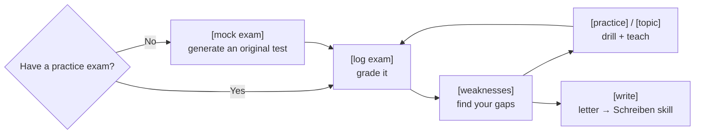

<!-- Translated from README.md at commit 8080cea. Re-translate when the English version changes. -->

# telc B1 Coach 🇩🇪

**🌍 Languages:** [English](README.md) · [العربية](README.ar.md) · [Türkçe](README.tr.md) · **Русский** · [Українська](README.uk.md) · [فارسی](README.fa.md) · [Español](README.es.md)

Два бесплатных дополнения («навыка», skills), которые превращают **Claude** — или другой ИИ, поддерживающий навыки, — в
строгого и требовательного наставника для экзамена **telc Deutsch B1** (немецкий язык уровня B1). Он оценивает ваши тренировочные
ответы, разбирает каждую ошибку, отрабатывает ваши слабые места, готовит вас к устной части
и помогает с письмом.

> ⭐ Если это помогает вашей подготовке, **поставьте звезду репозиторию** — это помогает другим учащимся его найти.

  

> Для общего экзамена **telc Deutsch B1** (взрослый *Zertifikat Deutsch* — сертификат по немецкому языку). **Не** DTZ
> и не Goethe B1.

Это руководство написано так, чтобы **любой человек по этой ссылке смог запустить всё за несколько минут**,
даже если вы никогда раньше не пользовались «навыками». Просто следуйте разделу для того приложения, которым вы пользуетесь.

---

## Что вы получаете

Два навыка, работающих вместе:

- **`telc-b1-exam`** — записывает и оценивает ваши ответы к тренировочному экзамену, объясняет, *почему* каждый
  ответ был неверным (ловушка + правило), извлекает из теста важную лексику, союзы и
  грамматику, отрабатывает ваши слабые места, проводит тренировку устной части и — если у вас нет
  тренировочных экзаменов — **создаёт для вас свежие, оригинальные задания** в настоящем формате
  telc. На вопросы по грамматике даются ответы из реальных источников, объяснённые простым языком.
- **`telc-b1-schreiben`** — помогает с **письменным письмом**: обучает формату, оценивает ваше
  письмо так, как это делают настоящие экзаменаторы, и отрабатывает те ошибки, которые вы повторяете снова и снова.

Вы просите нужное простым языком (*«оцени мои ответы»*, *«объясни weil против denn»*,
*«прошло бы это письмо?»*) или короткими командами вроде `[log exam]` или `/written-grade`.

> [!TIP]
> Нет тренировочных экзаменов? Просто введите `[mock exam]`, и он создаст оригинальные.

---

## Как это работает

Один цикл: создать или оценить экзамен, найти ваши слабые места, отработать их, повторить — и отделить
работу над письмом к наставнику по письму всякий раз, когда вы работаете над письмом.

---

## Шаг 1 — Скачайте навыки с этой страницы

1. Прокрутите к началу этого репозитория.
2. Нажмите зелёную кнопку **`< > Code`**, затем **Download ZIP**.
3. Распакуйте скачанный файл. Внутри вы найдёте две папки:
   **`telc-b1-exam`** и **`telc-b1-schreiben`**.

Вот и всё — эти две папки *и есть* навыки. Теперь установите их в свой ИИ, следуя подходящему разделу ниже.

---

## Шаг 2 — Установите их (выберите своё приложение)

### 🟣 Вариант A — Сайт Claude или приложение Claude (для большинства людей)

1. **Заархивируйте каждую папку с навыком по отдельности.** Вам нужен отдельный `.zip` для каждого навыка:
   - **Mac:** щёлкните правой кнопкой по папке `telc-b1-exam` → **Compress**. Повторите для
     `telc-b1-schreiben`.
   - **Windows:** щёлкните правой кнопкой по папке → **Send to → Compressed (zipped) folder**. Повторите
     для второй.
   *(В итоге у вас должны получиться `telc-b1-exam.zip` и `telc-b1-schreiben.zip`.)*
2. В Claude нажмите на **иконку профиля → Settings → Capabilities** и убедитесь, что
   **Code execution and file creation** (выполнение кода и создание файлов) **включено**. *(Это единственное, что навыкам
   действительно нужно.)*
3. Перейдите в **Customize → Skills**, нажмите **Upload skill** и выберите `telc-b1-exam.zip`.
   Сделайте то же самое для `telc-b1-schreiben.zip`.
4. Готово. Claude использует их автоматически, когда вы говорите об экзамене telc B1. Навыки, которые вы
   загружаете здесь, работают и в **Claude Chat**, и в **Cowork**.

> **Работает и на бесплатном тарифе** — навыки доступны на **Free, Pro, Max, Team и
> Enterprise**; единственное требование — чтобы было включено **Code execution and file creation**
> (шаг 2). На Free у вас просто действует обычный дневной лимит сообщений. На **Team/Enterprise** владельцу,
> возможно, придётся сначала включить навыки для организации (для Team они включены по умолчанию).
> Загрузка сюда **не** копирует навыки в Claude Code или в API — это
> отдельные вещи (см. ниже). Названия пунктов меню могут немного отличаться в зависимости от версии.

🟢 Вариант B — Claude Code (терминал / VS Code / JetBrains)

Никакого архивирования и загрузки — навыки — это просто папки на вашем компьютере.

1. Создайте папку для навыков, если её нет: `~/.claude/skills/`
   *(это папка с именем `skills` внутри скрытой папки `.claude` в вашем домашнем каталоге).*
2. Скопируйте в неё **обе** папки `telc-b1-exam` и `telc-b1-schreiben`.
3. Перезапустите сессию Claude Code. Он обнаружит и начнёт использовать их автоматически.

*(Хотите, чтобы они были доступны только внутри одного проекта, а не везде? Тогда положите папки в
папку `.claude/skills/` этого проекта.)*

🔵 Вариант C — Другой ИИ, поддерживающий навыки (Gemini, Codex, Cursor, Copilot…)

Agent Skills — это **открытый стандарт**, поэтому *те же самые папки* работают во многих других ИИ-инструментах.
Есть два случая:

**C1 — Инструменты для кода, которые читают файлы `SKILL.md`** (Gemini CLI, OpenAI Codex CLI, Cursor,
GitHub Copilot и более 25 других): скопируйте папки с навыками в каталог навыков этого инструмента —
например, **`.gemini/skills/`** для Gemini CLI — и перезапустите его. Навык работает
без изменений; ничего переписывать не нужно.

- Подсказка: многие из них поддерживают однострочный установщик, который сам помещает файлы в нужное место
  автоматически — `npx skills add <this-repo>` — подробности см. на **skills.sh**.

**C2 — Чат-ассистенты, которые вместо этого используют «пользовательские боты»** (**Gems** в приложении Gemini или
**GPTs** в ChatGPT): они не читают файлы навыков напрямую, но навык — это просто текстовые
инструкции, поэтому:

1. Откройте файл **`SKILL.md`** навыка (он находится внутри каждой папки) и скопируйте всё, что в нём есть.
2. Создайте новый **Gem** (Gemini) или **GPT** (ChatGPT) и вставьте этот текст в качестве его
   инструкций.
3. Если в навыке упоминаются файлы из его папки `references/`, прикрепите их как знания/файлы бота
   или вставьте нужный, когда наставник его попросит.

Это универсальный запасной вариант — он работает практически в любом ассистенте, хотя глубокий
справочный материал подгружается менее автоматически, чем в Claude.

---

## Шаг 3 — Проверьте, что всё работает

Начните новый чат и введите:

> **`[help]`**

Экзаменационный наставник должен перечислить свои команды. Или просто скажите *«Я хочу подготовиться к экзамену
telc B1»*, и он возьмёт дело в свои руки. Чтобы попробовать наставника по письму, скажите *«дай мне задание на письмо уровня B1»*.

---

## Какой навык что делает

| Навык | Что охватывает | Попробуйте сказать / ввести |
|---|---|---|
| **`telc-b1-exam`** | Чтение, Sprachbausteine, аудирование + **устный** экзамен, оценивание, тренировки, грамматика, **создание оригинальных тренировочных тестов** и **обучение с проверкой по отдельным темам** с отслеживанием готовности | `[mock exam]`, `[topic "connectors"]`, `[log exam]`, «объясни obwohl против trotzdem» |
| **`telc-b1-schreiben`** | **Письменное письмо** — формат, оценивание, отработка ошибок, обороты речи | `/written-grade`, «прошло бы это письмо?» |

Они работают в паре автоматически: экзаменационный наставник передаёт дело наставнику по письму всякий раз, когда вы работаете над
письмом, поэтому **устанавливайте оба**.

У каждого навыка также есть своё короткое руководство: [`telc-b1-exam/README.md`](telc-b1-exam/README.md)
и [`telc-b1-schreiben/README.md`](telc-b1-schreiben/README.md).

---

## Зачем это?

|                                            | Обычный чат с ИИ | **telc B1 Coach** | Платный курс подготовки |
|--------------------------------------------|:-------------:|:-----------------:|:----------------:|
| Цена                                       |   Бесплатно   |  **Бесплатно**    |       €€€        |
| Неограниченная оригинальная практика в формате telc |  ⚠️ общего рода  |        ✅         |   ❌ фиксированный набор   |
| Оценивает ваши ответы по ключам ответов    |      ❌       |        ✅         |        ✅        |
| Отслеживает *ваши* слабые места со временем |      ❌       |        ✅         |   ✅ (репетитор)     |
| Помощь с письменным письмом по критериям telc |     ⚠️        |        ✅         |        ✅        |
| Работает на вашем языке                    |      ✅       |        ✅         |     по-разному     |

_Примерный ориентир, а не научное сравнение._

---

## Пара вещей, которые стоит знать

- **Хотите ещё и официальные материалы?** telc даёт вам **бесплатный официальный образец экзамена** — полный
  тест *с ключами ответов и аудио для аудирования* — на своей странице B1. Скачайте его и укажите на него
  наставнику:
  **<https://www.telc.net/sprachpruefungen/deutsch/zertifikat-deutsch-telc-deutsch-b1/>**
  (у страницы есть и английская версия). Подойдёт любой тренировочный экзамен в формате telc; ключи ответов
  находятся на последней странице.
- **Каждое приложение устанавливается отдельно.** Загрузка на сайт Claude не синхронизируется с Claude
  Code или с другими ИИ — настройте каждое место, где хотите этим пользоваться.
- **Всё готово к работе сразу.** Навыки поставляются с начальным контентом (типичные экзаменационные ловушки, примеры
  шаблонов, банк оборотов речи), поэтому они полезны сразу же; Claude подстраивается под вас по мере того, как вы
  тренируетесь. Никакие персональные данные не включены.

> [!NOTE]
> Это независимое учебное пособие на основе ИИ, которое создаёт **оригинальную** практику — оно
> **не** является официальным материалом telc и не связано с telc.

---

## Частые вопросы

Это официальный материал telc?

Нет — это независимое учебное пособие, которое создаёт оригинальную практику. Не связано с telc.

Нужен ли мне платный план Claude?

Нет. Он работает на бесплатном плане, если включено Code execution & file creation.

Работает ли это в других ИИ?

Да — оно построено на открытом стандарте Agent Skills, поэтому также работает в Gemini CLI, OpenAI Codex CLI, Cursor и других.

У меня нет тренировочных экзаменов — могу ли я всё равно этим пользоваться?

Да. Введите <code>[mock exam]</code>, и он создаст оригинальную практику в формате telc с ключом ответов.

---

## Лицензия

MIT — см. [`LICENSE`](LICENSE). Если вы сделали форк или переопубликовали это, добавьте своё имя в строку
об авторских правах.

---

> ⭐ Если это помогает вашей подготовке, **поставьте звезду репозиторию** — это помогает другим учащимся его найти.
