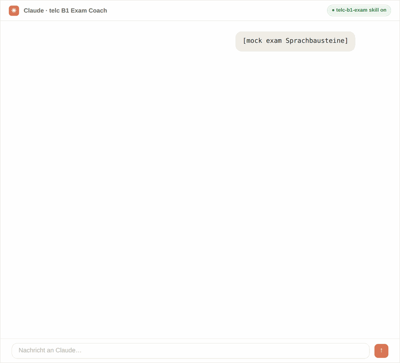
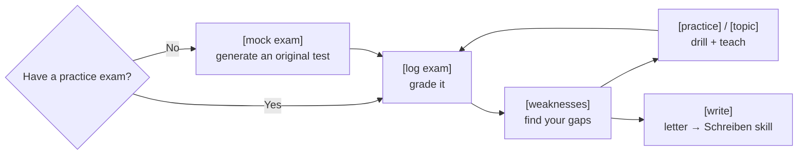

<!-- Translated from README.md at commit 8080cea. Re-translate when the English version changes. -->

# telc B1 Koçu 🇩🇪

**🌍 Languages:** [English](README.md) · [العربية](README.ar.md) · **Türkçe** · [Русский](README.ru.md) · [Українська](README.uk.md) · [فارسی](README.fa.md) · [Español](README.es.md)

**Claude**'u — ya da becerileri (skills) destekleyen başka bir yapay zekayı — **telc Deutsch B1** sınavı için sıkı, tavizsiz bir koça dönüştüren iki ücretsiz eklenti ("beceri"/skill). Alıştırma yanıtlarınızı puanlar, her hatayı açıklar, zayıf noktalarınızı çalıştırır, sizi konuşma sınavına hazırlar ve yazma becerinizde size koçluk yapar.

> ⭐ Bu, hazırlığınıza yardımcı oluyorsa **depoya yıldız verin** — bu, diğer öğrencilerin onu bulmasına yardımcı olur.

  

> Genel **telc Deutsch B1** sınavı (yetişkinlere yönelik *Zertifikat Deutsch*) içindir. DTZ **değildir**
> ve Goethe B1 de değildir.

Bu kılavuz, **daha önce hiç "beceri" (skill) kullanmamış olsanız bile, bu bağlantıya sahip herkesin birkaç dakika içinde çalışır hale getirebilmesi** için yazılmıştır. Sadece kullandığınız uygulamaya ait bölümü takip edin.

---

## Neler elde edersiniz

Birlikte çalışan iki beceri:

- **`telc-b1-exam`** — bir alıştırma sınavına verdiğiniz yanıtları kaydeder ve puanlar, her
  yanıtın *neden* yanlış olduğunu (tuzak + kural) size söyler, bir testten önemli kelimeleri, bağlaçları ve
  dilbilgisini çıkarır, zayıf noktalarınızı çalıştırır, konuşma pratiği yaptırır ve — elinizde hiç
  alıştırma sınavı yoksa — **gerçek telc formatında sizin için taze, özgün olanlar üretir**. Dilbilgisi
  soruları gerçek kaynaklardan yanıtlanır, basitçe açıklanır.
- **`telc-b1-schreiben`** — **yazılı mektup** konusunda koçluk yapar: formatı öğretir, mektubunuzu
  gerçek sınav değerlendiricileri gibi puanlar ve tekrar tekrar yaptığınız hataları çalıştırır.

İstediklerinizi düz bir dille (*"yanıtlarımı puanla"*, *"weil ile denn arasındaki farkı açıkla"*,
*"bu mektup geçer mi?"*) ya da `[log exam]` veya `/written-grade` gibi kısa komutlarla belirtebilirsiniz.

> [!TIP]
> Alıştırma sınavınız yok mu? Sadece `[mock exam]` yazın, o da özgün olanlar üretir.

---

## Nasıl çalışır

Tek döngü: bir sınav üret ya da puanla, zayıf noktalarını bul, çalıştır, tekrarla — ve mektup üzerinde
çalıştığınızda yazma koçuna ayrılın.

---

## Adım 1 — Becerileri bu sayfadan indirin

1. Bu deponun en üstüne kaydırın.
2. Yeşil **`< > Code`** düğmesine tıklayın, ardından **Download ZIP** seçeneğine tıklayın.
3. İndirdiğiniz dosyayı açın (unzip). İçinde iki klasör bulacaksınız:
   **`telc-b1-exam`** ve **`telc-b1-schreiben`**.

Hepsi bu — bu iki klasör *zaten* becerilerin kendisidir. Şimdi bunları aşağıdaki ilgili bölümü
kullanarak yapay zekanıza kurun.

---

## Adım 2 — Kurun (uygulamanızı seçin)

### 🟣 Seçenek A — Claude web sitesi veya Claude uygulaması (çoğu kişi)

1. **Her beceri klasörünü ayrı ayrı zip'leyin.** Her beceri için ayrı bir `.zip` gerekir:
   - **Mac:** `telc-b1-exam` klasörüne sağ tıklayın → **Compress**. `telc-b1-schreiben` için tekrarlayın.
   - **Windows:** klasöre sağ tıklayın → **Send to → Compressed (zipped) folder**. Diğeri için tekrarlayın.
   *(Sonunda elinizde `telc-b1-exam.zip` ve `telc-b1-schreiben.zip` olmalı.)*
2. Claude'da **profil simgeniz → Settings → Capabilities** yolunu izleyin ve
   **Code execution and file creation** özelliğinin **açık** olduğundan emin olun. *(Becerilerin gerçekten
   ihtiyaç duyduğu tek şey budur.)*
3. **Customize → Skills** bölümüne gidin, **Upload skill** düğmesine tıklayın ve `telc-b1-exam.zip` dosyasını seçin.
   Aynısını `telc-b1-schreiben.zip` için de yapın.
4. Bitti. telc B1 sınavından bahsettiğinizde Claude bunları otomatik olarak kullanır. Buraya
   yüklediğiniz beceriler hem **Claude Chat** hem de **Cowork** içinde çalışır.

> **Free planında da çalışır** — beceriler **Free, Pro, Max, Team ve Enterprise** planlarında
> mevcuttur; tek gereksinim **Code execution and file creation** özelliğinin etkin olmasıdır
> (adım 2). Free planında yalnızca normal günlük mesaj sınırınız olur. **Team/Enterprise** için, bir
> yöneticinin önce Skills özelliğini kuruluş genelinde açması gerekebilir (Team'de varsayılan olarak
> açıktır). Buraya yükleme yapmak becerileri Claude Code'a veya API'ye **kopyalamaz** — bunlar
> ayrıdır (aşağıya bakın). Menü adları sürüme göre biraz değişebilir.

🟢 Seçenek B — Claude Code (terminal / VS Code / JetBrains)

Zip'leme yok, yükleme yok — beceriler bilgisayarınızdaki klasörlerden ibarettir.

1. Yoksa skills klasörünü oluşturun: `~/.claude/skills/`
   *(bu, ev dizininizdeki gizli bir `.claude` klasörünün içinde `skills` adında bir klasördür).*
2. **Hem** `telc-b1-exam` **hem de** `telc-b1-schreiben` klasörlerini içine kopyalayın.
3. Claude Code oturumunuzu yeniden başlatın. Onları otomatik olarak keşfeder ve kullanır.

*(Bunları her yerde değil de yalnızca tek bir projenin içinde mi istiyorsunuz? Klasörleri bunun yerine o
projenin `.claude/skills/` klasörüne koyun.)*

🔵 Seçenek C — Becerileri destekleyen başka bir yapay zeka (Gemini, Codex, Cursor, Copilot…)

Agent Skills bir **açık standarttır**, bu yüzden *aynı klasörler* birçok başka yapay zeka aracında çalışır.
İki durum vardır:

**C1 — `SKILL.md` dosyalarını okuyan kodlama araçları** (Gemini CLI, OpenAI Codex CLI, Cursor,
GitHub Copilot ve 25+ diğerleri): beceri klasörlerini o aracın skills dizinine kopyalayın —
örneğin Gemini CLI için **`.gemini/skills/`** — ve yeniden başlatın. Beceri hiç
değiştirilmeden çalışır; yeniden yazmaya gerek yok.

- Kısayol: bunların çoğu, dosyaları otomatik olarak doğru yere koyan tek satırlık bir yükleyiciyi
  destekler — `npx skills add <this-repo>` — ayrıntılar için **skills.sh** adresine bakın.

**C2 — Bunun yerine "özel botlar" kullanan sohbet asistanları** (Gemini uygulamasının **Gems** özelliği veya
ChatGPT'nin **GPTs** özelliği): bunlar beceri dosyalarını doğrudan okumaz, ancak bir beceri sadece düz metin
talimatlardan ibarettir, dolayısıyla:

1. Bir becerinin **`SKILL.md`** dosyasını açın (her klasörün içindedir) ve içindeki her şeyi kopyalayın.
2. Yeni bir **Gem** (Gemini) veya **GPT** (ChatGPT) oluşturun ve o metni talimatları olarak
   yapıştırın.
3. Beceri kendi `references/` klasöründeki dosyalardan bahsediyorsa, bunları botun
   bilgi/dosyaları olarak ekleyin veya koç istediğinde ilgili olanı yapıştırın.

Bu, evrensel yedek çözümdür — esasen herhangi bir asistanda çalışır, ancak derinlemesine
referans materyali, Claude'daki kadar otomatik yüklenmez.

---

## Adım 3 — Çalıştığını kontrol edin

Yeni bir sohbet başlatın ve şunu yazın:

> **`[help]`**

Sınav koçu komutlarını listelemelidir. Ya da sadece *"telc B1 sınavına hazırlanmak
istiyorum"* deyin, gerisini o halleder. Yazma koçunu denemek için *"bana bir B1 yazma görevi ver"* deyin.

---

## Hangi beceri ne işe yarar

| Beceri | Kapsamı | Söyleyin / yazın |
|---|---|---|
| **`telc-b1-exam`** | Okuma (Leseverstehen), Sprachbausteine, Dinleme (Hörverstehen) + **konuşma** sınavı, puanlama, alıştırmalar, dilbilgisi, **özgün alıştırma testleri üretme** ve hazırlık takibiyle **tek konularda öğret-ve-test** | `[mock exam]`, `[topic "connectors"]`, `[log exam]`, "obwohl ile trotzdem arasındaki farkı açıkla" |
| **`telc-b1-schreiben`** | **Yazılı mektup** — format, puanlama, hata alıştırmaları, ifadeler | `/written-grade`, "bu mektup geçer mi?" |

Otomatik olarak eşleşirler: mektup üzerinde çalıştığınızda sınav koçu işi yazma koçuna devreder,
bu yüzden **ikisini de kurun**.

Her becerinin kendi kısa kılavuzu da vardır: [`telc-b1-exam/README.md`](telc-b1-exam/README.md)
ve [`telc-b1-schreiben/README.md`](telc-b1-schreiben/README.md).

---

## Neden bu?

|                                            | Sıradan yapay zeka sohbeti | **telc B1 Koçu** | Ücretli hazırlık kursu |
|--------------------------------------------|:-------------:|:-----------------:|:----------------:|
| Fiyat                                      |     Ücretsiz      |     **Ücretsiz**      |       €€€        |
| telc formatında sınırsız özgün alıştırma |  ⚠️ genel   |        ✅         |   ❌ sabit set   |
| Yanıtlarınızı cevap anahtarlarıyla puanlar       |      ❌       |        ✅         |        ✅        |
| Zamanla *sizin* zayıf noktalarınızı takip eder         |      ❌       |        ✅         |   ✅ (öğretmen)     |
| telc puanlama ölçütüne göre yazılı mektup koçluğu |     ⚠️        |        ✅         |        ✅        |
| Kendi dilinizde çalışır                     |      ✅       |        ✅         |     değişir       |

_Kabaca bir rehber, bilimsel bir karşılaştırma değil._

---

## Bilmeniz gereken birkaç şey

- **Resmi materyal de mi istiyorsunuz?** telc size **ücretsiz resmi bir örnek sınav** verir — *cevap
  anahtarları ve dinleme sesiyle birlikte* eksiksiz bir test — B1 sayfalarında. İndirin ve
  koça gösterin:
  **<https://www.telc.net/sprachpruefungen/deutsch/zertifikat-deutsch-telc-deutsch-b1/>**
  (sayfanın İngilizce sürümü de var). Herhangi bir telc formatındaki alıştırma sınavı işe yarar; cevap anahtarları
  son sayfadadır.
- **Her uygulama ayrı kurulur.** Claude web sitesine yükleme yapmak Claude
  Code'a veya diğer yapay zekalara senkronize olmaz — kullanmak istediğiniz her yeri ayrı ayrı ayarlayın.
- **Kutudan çıktığı gibi kullanıma hazırdır.** Beceriler başlangıç içeriğiyle (yaygın sınav tuzakları, örnek
  kalıplar, bir ifade bankası) gelir, bu yüzden hemen kullanışlıdırlar; siz pratik yaptıkça Claude size
  göre ince ayar yapar. Hiçbir kişisel veri içermez.

> [!NOTE]
> Bu, **özgün** alıştırma üreten bağımsız bir yapay zeka çalışma yardımcısıdır — resmi
> telc materyali **değildir** ve telc ile bağlantılı değildir.

---

## SSS

Bu resmi telc materyali mi?

Hayır — özgün alıştırma üreten bağımsız bir çalışma yardımcısıdır. telc ile bağlantılı değildir.

Ücretli bir Claude planına ihtiyacım var mı?

Hayır. Code execution & file creation etkin olduğu sürece free planında çalışır.

Diğer yapay zekalarda çalışır mı?

Evet — açık Agent Skills standardı üzerine kurulmuştur, bu yüzden Gemini CLI, OpenAI Codex CLI, Cursor ve diğerlerinde de çalışır.

Hiç alıştırma sınavım yok — yine de kullanabilir miyim?

Evet. <code>[mock exam]</code> yazın, o da cevap anahtarıyla birlikte özgün telc formatında alıştırma üretir.

---

## Lisans

MIT — bkz. [`LICENSE`](LICENSE). Bunu fork'ladıysanız veya yeniden yayınladıysanız, telif hakkı
satırına adınızı ekleyin.

---

> ⭐ Bu, hazırlığınıza yardımcı oluyorsa **depoya yıldız verin** — bu, diğer öğrencilerin onu bulmasına yardımcı olur.
