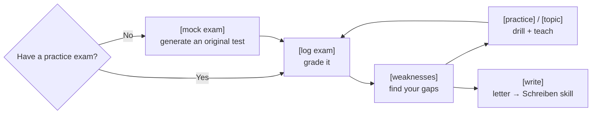

<!-- Translated from README.md at commit c460afa. Re-translate when the English version changes. -->

# مربی telc B1 🇩🇪

**🌍 Languages:** [English](../README.md) · [العربية](README.ar.md) · [Türkçe](README.tr.md) · [Русский](README.ru.md) · [Українська](README.uk.md) · **فارسی** · [Español](README.es.md)

[](https://github.com/aabuhammam-dh/telc-b1-coach/actions/workflows/ci.yml)

[](https://github.com/aabuhammam-dh/telc-b1-coach/stargazers)


دو افزونهٔ رایگان («مهارت» یا skill) که **Claude** — یا هر هوش مصنوعی دیگری که از مهارت‌ها پشتیبانی می‌کند — را به
یک مربی سخت‌گیر و جدی برای آزمون **telc Deutsch B1** (آلمانی سطح B1) تبدیل می‌کنند. این مربی پاسخ‌های تمرینی شما را
نمره می‌دهد، هر اشتباه را توضیح می‌دهد، نقاط ضعفتان را تمرین می‌دهد، شما را برای آزمون شفاهی آماده می‌کند،
و در نگارش شما را همراهی می‌کند.

> ⭐ اگر این به آماده‌سازی شما کمک کرد، **به این مخزن ستاره بدهید** — این کار به یادگیرندگان دیگر کمک می‌کند آن را پیدا کنند.

<p align="center">
  
</p>

> برای آزمون عمومی **telc Deutsch B1** (یعنی *Zertifikat Deutsch* بزرگسالان). **نه** DTZ،
> و نه Goethe B1.

این راهنما طوری نوشته شده که **هر کسی با این لینک می‌تواند در چند دقیقه آن را راه‌اندازی کند**،
حتی اگر تا به حال از هیچ «مهارتی» استفاده نکرده باشید. فقط بخش مربوط به برنامه‌ای که استفاده می‌کنید را دنبال کنید.

---

## چه چیزی به دست می‌آورید

دو مهارت که با هم کار می‌کنند:

- **`telc-b1-exam`** — پاسخ‌های شما به یک آزمون تمرینی را ثبت و نمره می‌دهد، به شما می‌گوید *چرا* هر
  پاسخ اشتباه بوده است (دام + قاعده)، واژگان مهم، حروف ربط و
  دستور زبان را از یک آزمون استخراج می‌کند، نقاط ضعفتان را تمرین می‌دهد، تمرین شفاهی اجرا می‌کند، و — اگر
  هیچ آزمون تمرینی نداشته باشید — **آزمون‌های تازه و اصیل برای شما تولید می‌کند** با فرمت واقعی
  telc. به پرسش‌های دستوری از منابع واقعی پاسخ داده و ساده توضیح داده می‌شود.
- **`telc-b1-schreiben`** — در **نامهٔ نگارشی** مربی شماست: فرمت را آموزش می‌دهد، نامهٔ شما را
  همان‌طور که ممتحنان واقعی نمره می‌دهند نمره می‌دهد، و اشتباه‌هایی را که مدام تکرار می‌کنید تمرین می‌دهد.

شما به زبان ساده درخواست می‌کنید (*«پاسخ‌هایم را نمره بده»*، *«فرق weil و denn را توضیح بده»*،
*«آیا این نامه قبول می‌شود؟»*) یا با دستورهای کوتاه مانند `[log exam]` یا `/written-grade`.

> [!TIP]
> آزمون تمرینی ندارید؟ فقط `[mock exam]` را تایپ کنید تا آزمون‌های اصیل تولید کند.

---

## چطور کار می‌کند



یک حلقه: آزمونی تولید یا نمره‌دهی کنید، نقاط ضعفتان را پیدا کنید، تمرینشان کنید، تکرار کنید — و هرگاه
روی نامه کار می‌کنید به مربی نگارش شاخه بزنید.

---

## گام ۱ — مهارت‌ها را از این صفحه دانلود کنید

1. به بالای این مخزن (repository) بروید.
2. روی دکمهٔ سبز **`< > Code`** کلیک کنید، سپس **Download ZIP**.
3. فایلی که دانلود کردید را از حالت فشرده خارج کنید. درون آن یک پوشهٔ `skills/` می‌یابید که این دو پوشهٔ مهارت را در بر دارد:
   **`telc-b1-exam`** و **`telc-b1-schreiben`**.

همین بود — همان دو پوشه *خودِ* مهارت‌ها هستند. حالا با استفاده از بخش متناسب زیر
آن‌ها را در هوش مصنوعی خود نصب کنید.

---

## گام ۲ — نصبشان کنید (برنامهٔ خود را انتخاب کنید)

### ⚡ سریع‌ترین — نصب تک‌خطی برای Claude Code و دیگر CLIها

اگر [Node.js](https://nodejs.org) را نصب کرده باشید، یک دستور واحد **هر دو** مهارت را به **Claude Code** (و Gemini CLI، Cursor، Codex و دیگر ابزارهایی که از استاندارد Agent Skills پیروی می‌کنند) اضافه می‌کند:

```bash
npx skills add aabuhammam-dh/telc-b1-coach
```

پس از آن ابزار هوش مصنوعی خود را دوباره راه‌اندازی کنید و مهارت‌ها به‌طور خودکار بارگذاری می‌شوند. *(این کار از نصب‌کنندهٔ متن‌باز [`skills`](https://github.com/vercel-labs/skills) از اکوسیستم Agent Skills استفاده می‌کند — نگه‌داری‌شده توسط جامعه، نه یک ابزار رسمی Anthropic.)*

**بازار افزونهٔ داخلی Claude Code را ترجیح می‌دهید؟** این مخزن را به‌عنوان یک بازار (marketplace) اضافه کنید، سپس افزونه را نصب کنید:

```text
/plugin marketplace add aabuhammam-dh/telc-b1-coach
/plugin install telc-b1-coach@telc-b1-coach
```

اهل ترمینال نیستید یا از وب‌سایت Claude استفاده می‌کنید؟ به‌جای آن یکی از گزینه‌های زیر را انتخاب کنید.

### 🟣 گزینهٔ الف — وب‌سایت Claude یا اپلیکیشن Claude (بیشتر افراد)

1. **هر پوشهٔ مهارت را جداگانه فشرده (zip) کنید.** برای هر مهارت به یک `.zip` جداگانه نیاز دارید:
   - **مک:** روی پوشهٔ `telc-b1-exam` راست‌کلیک کنید → **Compress**. برای
     `telc-b1-schreiben` تکرار کنید.
   - **ویندوز:** روی پوشه راست‌کلیک کنید → **Send to → Compressed (zipped) folder**. برای
     پوشهٔ دیگر تکرار کنید.
   *(باید در نهایت `telc-b1-exam.zip` و `telc-b1-schreiben.zip` داشته باشید.)*
2. در Claude، روی **آیکون پروفایل خود → Settings → Capabilities** کلیک کنید، و مطمئن شوید که
   **Code execution and file creation** روشن (**on**) است. *(این تنها چیزی است که مهارت‌ها
   واقعاً به آن نیاز دارند.)*
3. به **Customize → Skills** بروید، روی **Upload skill** کلیک کنید، و `telc-b1-exam.zip` را انتخاب کنید.
   این کار را برای `telc-b1-schreiben.zip` تکرار کنید.
4. تمام. Claude هنگامی که دربارهٔ آزمون telc B1 صحبت کنید، به‌طور خودکار از آن‌ها استفاده می‌کند. مهارت‌هایی که
   اینجا بارگذاری می‌کنید هم در **Claude Chat** و هم در **Cowork** کار می‌کنند.

> **روی پلن رایگان هم کار می‌کند** — مهارت‌ها در پلن‌های **Free، Pro، Max، Team و
> Enterprise** در دسترس‌اند؛ تنها شرط این است که **Code execution and file creation** فعال باشد
> (گام ۲). در پلن Free فقط محدودیت روزانهٔ معمول پیام‌ها را دارید. در **Team/Enterprise**، ممکن است لازم باشد
> یک مالک ابتدا مهارت‌ها را برای سازمان روشن کند (برای Team به‌طور پیش‌فرض روشن است). بارگذاری در اینجا مهارت‌ها را
> به Claude Code یا API کپی **نمی‌کند** — آن‌ها
> جداگانه‌اند (پایین‌تر را ببینید). نام منوها ممکن است بسته به نسخه کمی متفاوت باشد.

<details>
<summary>🟢 گزینهٔ ب — Claude Code (ترمینال / VS Code / JetBrains)</summary>

بدون فشرده‌سازی، بدون بارگذاری — مهارت‌ها فقط پوشه‌هایی روی کامپیوتر شما هستند.

1. اگر پوشهٔ مهارت‌ها وجود ندارد آن را بسازید: `~/.claude/skills/`
   *(یعنی پوشه‌ای به نام `skills` درون یک پوشهٔ مخفی `.claude` در پوشهٔ خانگی شما).*
2. **هر دو** پوشهٔ `telc-b1-exam` و `telc-b1-schreiben` (که درون پوشهٔ `skills/` دانلودشده قرار دارند) را درون آن کپی کنید.
3. نشست Claude Code خود را دوباره راه‌اندازی کنید. آن‌ها را کشف کرده و به‌طور خودکار استفاده می‌کند.

*(می‌خواهید فقط درون یک پروژه باشند نه همه‌جا؟ به‌جای آن پوشه‌ها را در پوشهٔ
`.claude/skills/` همان پروژه بگذارید.)*

</details>

<details>
<summary>🔵 گزینهٔ ج — هوش مصنوعی دیگری که از مهارت‌ها پشتیبانی می‌کند (Gemini، Codex، Cursor، Copilot…)</summary>

Agent Skills یک **استاندارد باز** است، بنابراین *همان پوشه‌ها* در بسیاری از ابزارهای هوش مصنوعی دیگر کار می‌کنند.
دو حالت وجود دارد:

**ج۱ — ابزارهای برنامه‌نویسی که فایل‌های `SKILL.md` را می‌خوانند** (Gemini CLI، OpenAI Codex CLI، Cursor،
GitHub Copilot و ۲۵+ ابزار دیگر): پوشه‌های مهارت را در پوشهٔ مهارت‌های آن ابزار کپی کنید —
برای مثال، **`.gemini/skills/`** برای Gemini CLI — و آن را دوباره راه‌اندازی کنید. مهارت بدون تغییر
کار می‌کند؛ هیچ بازنویسی‌ای لازم نیست.

- میان‌بر: بسیاری از این‌ها از یک نصب‌کنندهٔ تک‌خطی پشتیبانی می‌کنند که فایل‌ها را به‌طور خودکار در جای درست قرار می‌دهد
  — `npx skills add <this-repo>` — برای جزئیات **skills.sh** را ببینید.

**ج۲ — دستیارهای گفت‌وگویی که به‌جای آن از «بات‌های سفارشی» استفاده می‌کنند** (بخش **Gems** در اپلیکیشن Gemini، یا
**GPTs** در ChatGPT): این‌ها فایل‌های مهارت را مستقیماً نمی‌خوانند، اما یک مهارت صرفاً دستورالعمل‌های متنی ساده است، بنابراین:

1. فایل **`SKILL.md`** یک مهارت را باز کنید (درون هر پوشه است) و همهٔ محتوای آن را کپی کنید.
2. یک **Gem** جدید (Gemini) یا **GPT** جدید (ChatGPT) بسازید و آن متن را به‌عنوان
   دستورالعمل‌های آن جای‌گذاری کنید.
3. اگر مهارت به فایل‌هایی در پوشهٔ `references/` خود اشاره می‌کند، آن‌ها را به‌عنوان دانش/فایل‌های
   بات پیوست کنید، یا هنگامی که مربی درخواست کرد، فایل مربوط را جای‌گذاری کنید.

این راه‌حل جایگزین جهانی است — عملاً در هر دستیاری کار می‌کند، هرچند مواد مرجع عمیق
کمتر به‌طور خودکار بارگذاری می‌شوند تا در Claude.

</details>

---

## گام ۳ — بررسی کنید که کار می‌کند

یک گفت‌وگوی جدید باز کنید و تایپ کنید:

> **`[help]`**

مربی آزمون باید فهرست دستورهای خود را نمایش دهد. یا فقط بگویید *«می‌خواهم برای آزمون telc B1
تمرین کنم»* و کار را به دست می‌گیرد. برای امتحان مربی نگارش، بگویید *«یک تکلیف نگارشی B1 به من بده»*.

---

## هر مهارت چه کاری انجام می‌دهد

| مهارت | پوشش می‌دهد | این را بگویید / تایپ کنید |
|---|---|---|
| **`telc-b1-exam`** | خواندن (Leseverstehen)، Sprachbausteine، شنیدن (Hörverstehen) + آزمون **شفاهی**، نمره‌دهی، تمرین‌ها، دستور زبان، **تولید آزمون‌های تمرینی اصیل**، و **آموزش و آزمون تک‌موضوعی** با پیگیری آمادگی | `[mock exam]`، `[topic "connectors"]`، `[log exam]`، "explain obwohl vs. trotzdem" |
| **`telc-b1-schreiben`** | **نامهٔ نگارشی** — فرمت، نمره‌دهی، تمرین اشتباه‌ها، عبارت‌ها | `/written-grade`، "would this letter pass?" |

آن‌ها به‌طور خودکار جفت می‌شوند: هرگاه روی نامه کار کنید مربی آزمون کار را به مربی نگارش
تحویل می‌دهد، پس **هر دو را نصب کنید**.

هر مهارت راهنمای کوتاه خودش را هم دارد: [`skills/telc-b1-exam/README.md`](../skills/telc-b1-exam/README.md)
و [`skills/telc-b1-schreiben/README.md`](../skills/telc-b1-schreiben/README.md).

---

## چرا این؟

|                                            | چت معمولی هوش مصنوعی | **مربی telc B1** | دورهٔ آماده‌سازی پولی |
|--------------------------------------------|:-------------:|:-----------------:|:----------------:|
| قیمت                                      |     رایگان      |     **رایگان**      |       €€€        |
| تمرین اصیل نامحدود با فرمت telc |  ⚠️ عمومی   |        ✅         |   ❌ مجموعهٔ ثابت   |
| نمره‌دهی پاسخ‌های شما با کلید پاسخ       |      ❌       |        ✅         |        ✅        |
| پیگیری نقاط ضعف *شما* در طول زمان         |      ❌       |        ✅         |   ✅ (معلم خصوصی)     |
| مربیگری نامهٔ نگارشی مطابق معیار telc |     ⚠️        |        ✅         |        ✅        |
| به زبان خودتان کار می‌کند                     |      ✅       |        ✅         |     متغیر       |

_راهنمای تقریبی، نه یک مقایسهٔ علمی._

---

## چند نکته که خوب است بدانید

- **مواد رسمی هم می‌خواهید؟** telc یک **آزمون نمونهٔ رسمی رایگان** در اختیارتان می‌گذارد — یک آزمون
  کامل *همراه با کلید پاسخ‌ها و فایل صوتی شنیدن* — در صفحهٔ B1 خود. آن را دانلود کنید و مربی را به آن ارجاع دهید:
  **<https://www.telc.net/sprachpruefungen/deutsch/zertifikat-deutsch-telc-deutsch-b1/>**
  (این صفحه نسخهٔ انگلیسی هم دارد). هر آزمون تمرینی با فرمت telc کار می‌کند؛ کلید پاسخ‌ها
  در آخرین صفحه است.
- **هر برنامه جداگانه نصب می‌شود.** بارگذاری در وب‌سایت Claude با Claude
  Code یا با سایر هوش‌های مصنوعی همگام‌سازی نمی‌شود — هر جایی که می‌خواهید از آن استفاده کنید را جداگانه راه‌اندازی کنید.
- **از همان ابتدا آماده است.** مهارت‌ها با محتوای اولیه عرضه می‌شوند (دام‌های رایج آزمون، الگوهای نمونه،
  یک بانک عبارت) پس بلافاصله سودمندند؛ Claude همان‌طور که تمرین می‌کنید خود را برای شما تنظیم می‌کند.
  هیچ داده شخصی‌ای گنجانده نشده است.

> [!NOTE]
> این یک ابزار مطالعهٔ مستقل مبتنی بر هوش مصنوعی است که تمرین **اصیل** تولید می‌کند — این
> مطلب رسمی telc **نیست** و به telc وابسته نیست.

---

## پرسش‌های پرتکرار

<details>
<summary>آیا این مطلب رسمی telc است؟</summary>

نه — این یک ابزار مطالعهٔ مستقل است که تمرین اصیل تولید می‌کند. به telc وابسته نیست.
</details>

<details>
<summary>آیا به پلن پولی Claude نیاز دارم؟</summary>

نه. تا زمانی که Code execution & file creation فعال باشد، روی پلن رایگان کار می‌کند.
</details>

<details>
<summary>آیا در سایر هوش‌های مصنوعی کار می‌کند؟</summary>

بله — این بر پایهٔ استاندارد باز Agent Skills ساخته شده، پس در Gemini CLI، OpenAI Codex CLI، Cursor و دیگران هم اجرا می‌شود.
</details>

<details>
<summary>هیچ آزمون تمرینی ندارم — آیا باز هم می‌توانم از آن استفاده کنم؟</summary>

بله. <code>[mock exam]</code> را تایپ کنید تا تمرین اصیل با فرمت telc همراه با کلید پاسخ تولید کند.
</details>

---

## مجوز

MIT — [`LICENSE`](../LICENSE) را ببینید. اگر این را فورک یا بازنشر کردید، نام خود را به خط
حق‌نشر اضافه کنید.

---

> ⭐ اگر این به آماده‌سازی شما کمک کرد، **به این مخزن ستاره بدهید** — این کار به یادگیرندگان دیگر کمک می‌کند آن را پیدا کنند.
