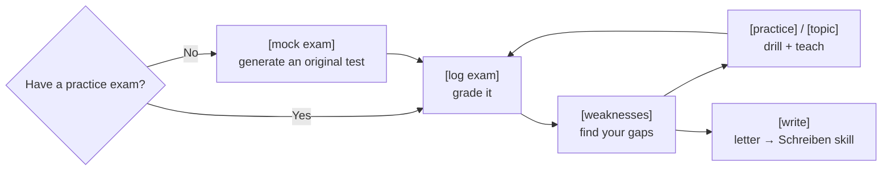

<!-- Translated from README.md at commit c460afa. Re-translate when the English version changes. -->

# Тренер telc B1 🇩🇪

**🌍 Languages:** [English](../README.md) · [العربية](README.ar.md) · [Türkçe](README.tr.md) · [Русский](README.ru.md) · **Українська** · [فارسی](README.fa.md) · [Español](README.es.md)


[](https://github.com/aabuhammam-dh/telc-b1-coach/stargazers)


Два безкоштовні доповнення («навички»/skills), які перетворюють **Claude** — або інший ШІ, що підтримує навички — на
суворого, безкомпромісного тренера для іспиту **telc Deutsch B1** (німецька мова, рівень B1). Він оцінює ваші тренувальні
відповіді, пояснює кожну помилку, відпрацьовує ваші слабкі місця, готує вас до усного іспиту
та тренує ваше письмо.

> ⭐ Якщо це допомагає вашій підготовці, **поставте зірку репозиторію** — це допоможе іншим учням знайти його.

<p align="center">
  
</p>

> Для загального іспиту **telc Deutsch B1** (дорослий *Zertifikat Deutsch* — сертифікат із німецької мови). **Не** DTZ
> і не Goethe B1.

Цей посібник написано так, щоб **будь-хто, у кого є це посилання, зміг запустити все за кілька хвилин**,
навіть якщо ви ніколи раніше не користувалися «навичкою». Просто дотримуйтесь розділу для того застосунку, яким ви користуєтесь.

---

## Що ви отримуєте

Дві навички, що працюють разом:

- **`telc-b1-exam`** — записує та оцінює ваші відповіді на тренувальному іспиті, пояснює, *чому* кожна
  відповідь була неправильною (пастка + правило), витягує важливу лексику, сполучники та
  граматику з тесту, відпрацьовує ваші слабкі місця, проводить розмовну практику і — якщо у вас немає
  жодних тренувальних іспитів — **генерує для вас нові, оригінальні** у справжньому форматі telc.
  Граматичні питання отримують відповіді з реальних джерел, пояснені просто.
- **`telc-b1-schreiben`** — тренує **письмовий лист**: навчає формату, оцінює ваш
  лист так, як це роблять справжні екзаменатори, і відпрацьовує помилки, які ви постійно повторюєте.

Ви просите про потрібне звичайною мовою (*«оціни мої відповіді»*, *«поясни weil проти denn»*,
*«чи склав би цей лист іспит?»*) або короткими командами на кшталт `[log exam]` чи `/written-grade`.

> [!TIP]
> Немає тренувальних іспитів? Просто введіть `[mock exam]`, і він згенерує оригінальні.

---

## Як це працює



Один цикл: згенеруйте або оцініть іспит, знайдіть свої слабкі місця, відпрацюйте їх, повторіть — і відгалужуйтесь
до тренера з письма щоразу, коли працюєте над листом.

---

## Крок 1 — Завантажте навички з цієї сторінки

1. Прокрутіть угору цього репозиторію.
2. Натисніть зелену кнопку **`< > Code`**, а потім **Download ZIP**.
3. Розпакуйте завантажений файл. Усередині ви знайдете дві теки:
   **`telc-b1-exam`** та **`telc-b1-schreiben`**.

Ось і все — ці дві теки *і є* навички. Тепер встановіть їх у ваш ШІ, скориставшись відповідним розділом нижче.

---

## Крок 2 — Встановіть їх (виберіть свій застосунок)

### ⚡ Найшвидше — однорядкове встановлення для Claude Code та інших CLI

Якщо у вас встановлено [Node.js](https://nodejs.org), одна команда додає **обидві** навички до **Claude Code** (а також до Gemini CLI, Cursor, Codex та інших інструментів, що дотримуються стандарту Agent Skills):

```bash
npx skills add aabuhammam-dh/telc-b1-coach
```

Після цього перезапустіть ваш ШІ-інструмент, і навички завантажаться автоматично. *(Тут використовується інсталятор із відкритим кодом [`skills`](https://github.com/vercel-labs/skills) з екосистеми Agent Skills — його підтримує спільнота, це не офіційний інструмент Anthropic.)*

Не любите термінал або користуєтеся вебсайтом Claude? Тоді виберіть один з варіантів нижче.

### 🟣 Варіант A — вебсайт Claude або застосунок Claude (для більшості)

1. **Заархівуйте кожну теку навички окремо.** Вам потрібен окремий `.zip` для кожної навички:
   - **Mac:** клацніть правою кнопкою на теці `telc-b1-exam` → **Compress**. Повторіть для
     `telc-b1-schreiben`.
   - **Windows:** клацніть правою кнопкою на теці → **Send to → Compressed (zipped) folder**. Повторіть
     для іншої.
   *(У вас має вийти `telc-b1-exam.zip` та `telc-b1-schreiben.zip`.)*
2. У Claude натисніть **іконку профілю → Settings → Capabilities** і переконайтеся, що
   **Code execution and file creation** (виконання коду та створення файлів) **увімкнено**. *(Це єдине, що навичкам
   насправді потрібно.)*
3. Перейдіть до **Customize → Skills**, натисніть **Upload skill** і виберіть `telc-b1-exam.zip`.
   Зробіть те саме для `telc-b1-schreiben.zip`.
4. Готово. Claude використовує їх автоматично, коли ви говорите про іспит telc B1. Навички, які ви
   завантажуєте тут, працюють як у **Claude Chat**, так і в **Cowork**.

> **Працює й на безкоштовному тарифі** — навички доступні на тарифах **Free, Pro, Max, Team та
> Enterprise**; єдина вимога — щоб було ввімкнено **Code execution and file creation**
> (крок 2). На Free ви просто маєте звичайний денний ліміт повідомлень. На **Team/Enterprise** власнику,
> можливо, доведеться спершу ввімкнути Skills для організації (для Team це ввімкнено за замовчуванням).
> Завантаження тут **не** копіює навички до Claude Code чи API — це
> окремі речі (див. нижче). Назви пунктів меню можуть трохи відрізнятися залежно від версії.

<details>
<summary>🟢 Варіант B — Claude Code (термінал / VS Code / JetBrains)</summary>

Жодного архівування, жодного завантаження — навички це просто теки на вашому комп'ютері.

1. Створіть теку для навичок, якщо її ще немає: `~/.claude/skills/`
   *(це тека з назвою `skills` усередині прихованої теки `.claude` у вашому домашньому каталозі).*
2. Скопіюйте **обидві** теки `telc-b1-exam` та `telc-b1-schreiben` до неї.
3. Перезапустіть сесію Claude Code. Він виявляє та використовує їх автоматично.

*(Хочете, щоб вони були лише всередині одного проєкту, а не всюди? Розмістіть теки у теці
`.claude/skills/` цього проєкту.)*

</details>

<details>
<summary>🔵 Варіант C — інший ШІ, що підтримує навички (Gemini, Codex, Cursor, Copilot…)</summary>

Agent Skills — це **відкритий стандарт**, тож *ті самі теки* працюють у багатьох інших ШІ-інструментах.
Є два випадки:

**C1 — інструменти для кодування, що читають файли `SKILL.md`** (Gemini CLI, OpenAI Codex CLI, Cursor,
GitHub Copilot та 25+ інших): скопіюйте теки навичок до каталогу навичок цього інструмента —
наприклад, **`.gemini/skills/`** для Gemini CLI — і перезапустіть його. Навичка працює
без змін; нічого переписувати не потрібно.

- Швидкий спосіб: багато з них підтримують однорядковий інсталятор, який автоматично розміщує файли у потрібному місці
  — `npx skills add <this-repo>` — див. **skills.sh** для деталей.

**C2 — чат-асистенти, що натомість використовують «власних ботів»** (**Gems** у застосунку Gemini або
**GPTs** у ChatGPT): вони не читають файли навичок безпосередньо, але навичка це просто текстові
інструкції, тож:

1. Відкрийте файл **`SKILL.md`** навички (він усередині кожної теки) і скопіюйте все, що в ньому є.
2. Створіть новий **Gem** (Gemini) або **GPT** (ChatGPT) і вставте цей текст як його
   інструкції.
3. Якщо навичка згадує файли у своїй теці `references/`, додайте їх як знання/файли бота
   або вставте потрібний, коли тренер про це попросить.

Це універсальний запасний варіант — він працює практично в будь-якому асистенті, хоча глибокий
довідковий матеріал завантажується менш автоматично, ніж у Claude.

</details>

---

## Крок 3 — Перевірте, що все працює

Почніть новий чат і введіть:

> **`[help]`**

Тренер з іспиту має вивести перелік своїх команд. Або просто скажіть *«Я хочу підготуватися до
іспиту telc B1»*, і він усе візьме на себе. Щоб випробувати тренера з письма, скажіть *«дай мені завдання на письмо рівня B1»*.

---

## Яка навичка що робить

| Навичка | Охоплює | Спробуйте сказати / ввести |
|---|---|---|
| **`telc-b1-exam`** | Читання (Leseverstehen), Sprachbausteine, Аудіювання (Hörverstehen) + **усний** іспит, оцінювання, вправи, граматику, **генерацію оригінальних тренувальних тестів** та **навчання та перевірку окремих тем** з відстеженням готовності | `[mock exam]`, `[topic "connectors"]`, `[log exam]`, «поясни obwohl проти trotzdem» |
| **`telc-b1-schreiben`** | **Письмовий лист** — формат, оцінювання, вправи на помилки, фрази | `/written-grade`, «чи склав би цей лист іспит?» |

Вони поєднуються автоматично: тренер з іспиту передає естафету тренеру з письма щоразу, коли ви працюєте над
листом, тож **встановіть обидві**.

Кожна навичка також має власний короткий посібник: [`telc-b1-exam/README.md`](telc-b1-exam/README.md)
та [`telc-b1-schreiben/README.md`](telc-b1-schreiben/README.md).

---

## Чому саме це?

|                                            | Звичайний чат зі ШІ | **Тренер telc B1** | Платний курс підготовки |
|--------------------------------------------|:-------------:|:-----------------:|:----------------:|
| Ціна                                       |  Безкоштовно  |  **Безкоштовно**  |       €€€        |
| Необмежена оригінальна практика у форматі telc |  ⚠️ загальна   |        ✅         |   ❌ фіксований набір   |
| Оцінює ваші відповіді з ключами відповідей |      ❌       |        ✅         |        ✅        |
| Відстежує *ваші* слабкі місця з часом      |      ❌       |        ✅         |   ✅ (репетитор)     |
| Тренування письмового листа за рубрикою telc |     ⚠️        |        ✅         |        ✅        |
| Працює вашою мовою                         |      ✅       |        ✅         |     залежить     |

_Приблизний орієнтир, а не наукове порівняння._

---

## Кілька речей, які варто знати

- **Хочете й офіційний матеріал?** telc надає вам **безкоштовний офіційний зразковий іспит** — повний
  тест *із ключами відповідей та аудіо для аудіювання* — на своїй сторінці B1. Завантажте його та вкажіть
  на нього тренеру:
  **<https://www.telc.net/sprachpruefungen/deutsch/zertifikat-deutsch-telc-deutsch-b1/>**
  (сторінка має і англійську версію). Підійде будь-який тренувальний іспит у форматі telc; ключі відповідей —
  на останній сторінці.
- **Кожен застосунок встановлюється окремо.** Завантаження на вебсайт Claude не синхронізується з Claude
  Code чи іншими ШІ — налаштуйте кожне місце, де хочете цим користуватися.
- **Усе готове до роботи.** Навички постачаються зі стартовим вмістом (поширені екзаменаційні пастки, приклади
  шаблонів, банк фраз), тож вони корисні одразу; Claude підлаштовується під вас, поки ви
  тренуєтесь. Жодних персональних даних не включено.

> [!NOTE]
> Це незалежний навчальний ШІ-помічник, який генерує **оригінальну** практику — він
> **не** є офіційним матеріалом telc і не пов'язаний із telc.

---

## FAQ

<details>
<summary>Це офіційний матеріал telc?</summary>

Ні — це незалежний навчальний помічник, який генерує оригінальну практику. Не пов'язаний із telc.
</details>

<details>
<summary>Чи потрібен мені платний тариф Claude?</summary>

Ні. Він працює на безкоштовному тарифі, доки ввімкнено Code execution & file creation.
</details>

<details>
<summary>Чи працює він в інших ШІ?</summary>

Так — він побудований на відкритому стандарті Agent Skills, тож також працює в Gemini CLI, OpenAI Codex CLI, Cursor та інших.
</details>

<details>
<summary>У мене немає жодних тренувальних іспитів — чи можу я все одно ним користуватися?</summary>

Так. Введіть <code>[mock exam]</code>, і він згенерує оригінальну практику у форматі telc з ключем відповідей.
</details>

---

## Ліцензія

MIT — див. [`LICENSE`](LICENSE). Якщо ви зробили форк або перепублікували це, додайте своє ім'я до рядка про
авторське право.

---

> ⭐ Якщо це допомагає вашій підготовці, **поставте зірку репозиторію** — це допоможе іншим учням знайти його.
